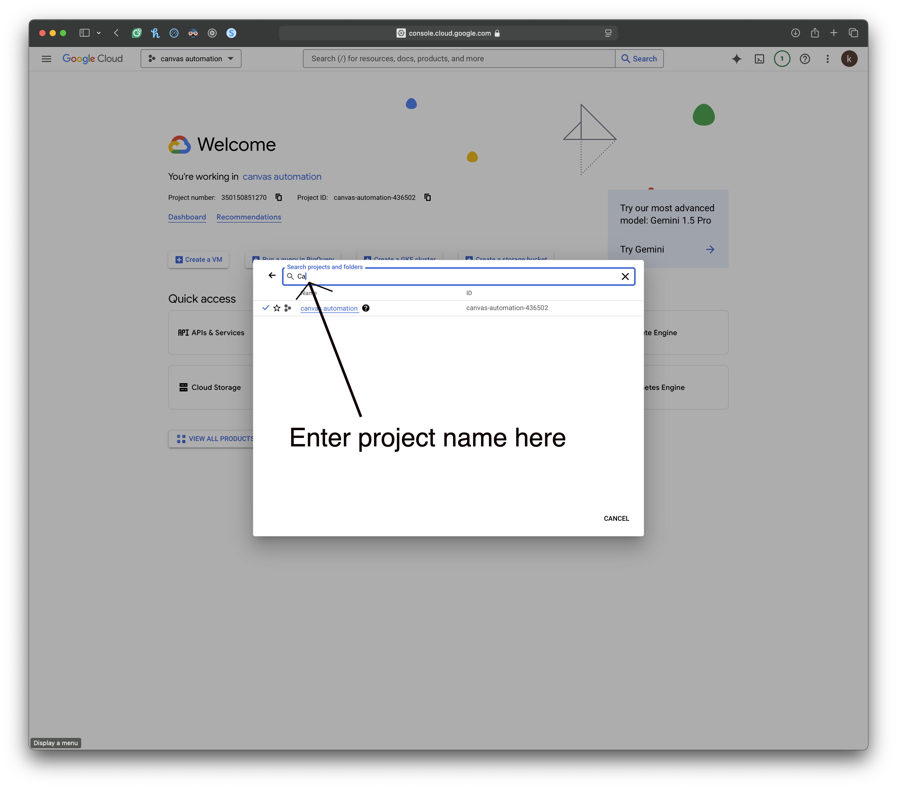

Setting up Google API
---------------------

* Go to Google Cloud Console ``https://console.cloud.google.com/``
* Create a new project

* Enable the Google Forms API.

   * Enable Forms API  - ``https://console.cloud.google.com/apis/library/forms.googleapis.com``
   * Enable Sheets API - ``https://console.cloud.google.com/apis/library/sheets.googleapis.com``
   * Enable Drive API - ``https://console.cloud.google.com/apis/library/drive.googleapis.com``

* Enable beta users for the Google Forms API. (Add users by their emails)

   ``https://console.cloud.google.com/apis/credentials/consent``

   .. image:: _static/GoogleAPI/Credentials.png
      :width: 800
      :alt: Google Credentials Page

* Create credentials and download the ``client_secrets.json`` file. ( Create Credentials ->  OAuth Client ID )
   ``https://console.cloud.google.com/apis/credentials``

   .. image:: _static/GoogleAPI/AddingTestUser.png
      :width: 800
      :alt: Adding Test User in Google Cloud Console