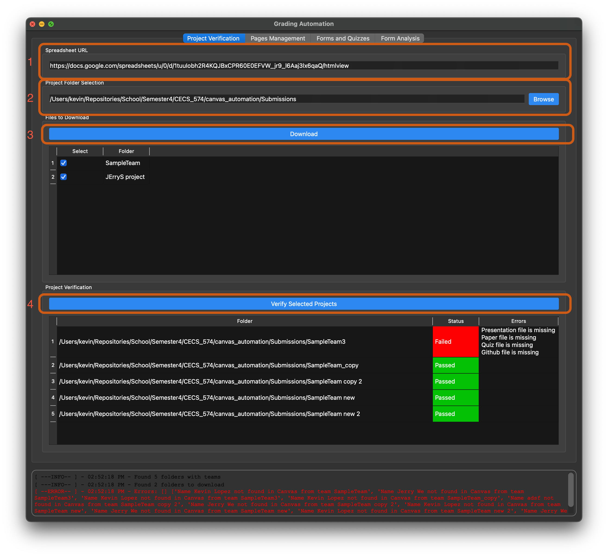

Using the Application ( Manual )
--------------------------------

Start the application using one of these methods:
^^^^^^^^^^^^^^^^^^^^^^^^^^^^^^^^^^^^^^^^^^^^^^^^^

* Run Python script::

    python GradingAutomationUI.py

* Or download and run the executable from the latest release

  Note: For macOS users, you may need to allow opening apps from unknown developers

Configure the application:
^^^^^^^^^^^^^^^^^^^^^^^^^^
* Enter the Canvas class ID (e.g., ``15319``)
* Provide your Canvas access token
* Enter the presentation module title (e.g., ``Fall 2024 - Presentation``)

.. image:: _static/canvas_config.png
  :width: 800
  :alt: Canvas Configuration Screenshot

Download student submissions and verify projects in "Project Verification" Tab:
^^^^^^^^^^^^^^^^^^^^^^^^^^^^^^^^^^^^^^^^^^^^^^^^^^^^^^^^^^^^^^^^^^^^^^^^^^^^^^^
1. Enter the the spreadsheet url.

* For testing use the following: ``https://docs.google.com/spreadsheets/u/0/d/1tuuIobh2R4KQJBxCPR60E0EFVW_jr9_l6Aaj3lx6qaQ/htmlview``

2. Enter the location where the files will be downloaded.

* This location will cross-check projects with the spreadsheet, enabling you to download missing projects if any.

3. Click on verify projects to analyze the spreadsheet

* Once verified, click on download submissions to download missing projects.

    * The GUI only shows the missing projects that still need to be download on the computer.

4. After the files are downloaded, click on verify submissions to verify that the files are present and correct.

    * If anything is wrong with the student names or emails, the log window will display what's wrong.
    * If anything is wrong with the files, the table will display an error message in the `Errors` column.

Below is how steps 1 to 4 would appear on the GUI.

Below is how the input spreadsheet looks like:

.. image:: _static/spreadsheet.png
  :width: 800
  :alt: spreadsheet

Create Canvas Pages from group folders on "Page Management" Tab:
^^^^^^^^^^^^^^^^^^^^^^^^^^^^^^^^^^^^^^^^^^^^^^^^^^^^^^^^^^^^^^^^

* This panel is used to create the pages on Canvas for the team.
* The GUI will only displayed verified project from the "Project Verification" Tab.

.. image:: _static/page_management.png
  :width: 800
  :alt: Page Management Screenshot

Adding Forms and Quizzes and Grading Responses on "Form and Quizzes" Tab:
^^^^^^^^^^^^^^^^^^^^^^^^^^^^^^^^^^^^^^^^^^^^^^^^^^^^^^^^^^^^^^^^^^^^^^^^^

* This panel is used to add the feedback forms and quizzes on Canvas, and grade the assignment based on the feedback forms.
* Initially, the program fetches the canvas page status and updates the `Status` Column based on the status response.

    * Status response types:

        * ``Not Created`` - page is not created by the application.
        * ``Quiz and Feedback added`` - quiz and feedback forms are added to the page.
        * ``Done`` - page is created and graded by the application.
        * ``No Local, No Spreadsheet`` - page is not created because there are no local files and the page is not found in the spreadsheet.
        * ``No Local, Yes Spreadsheet`` - page is not created because there are no local files but the page is in the spreadsheet.
        * ``Evaluation Form`` - page was manually created. Keyword ``Evaluation`` is added by the professor, not by the application.

* We enabled the ability for manually create pages to be graded without affecting the behavior of the application.

    * If you're grading the page(s) manually, then ensure that you enter the **feedback form ID** in the spreadsheet.

.. image:: _static/forms_quizzes.png
  :width: 800
  :alt: Forms and Quizzes Screenshot

* When grading a page is complete, there will be an image attached to the page to display the grade distribution histogram.

    * All the reponses used for grading are saved in a `.xslx` file under the same directory as the project graded.

.. image:: _static/grade_distribution.png
  :width: 800
  :alt: Grade Distribution Screenshot

Analyze Form Responses in "Form Analysis" Tab.
^^^^^^^^^^^^^^^^^^^^^^^^^^^^^^^^^^^^^^^^^^^^^^

* This panel is used to analyze the feedback forms and aggregate the respones into a single file.

1. Click the ``Aggregate Responses`` button to combine the responese from the google form.

    * All of the responeses will be stored under ``grading/all_form_respones.xlsx``.

2. Click on the ``Analyze Responses`` button to analyze the responses.

    * The following analysis is performed:

        * Distribution for all presentations - Shows the grade distribution across all team presentations
        * Each student average grading for others - Displays how each student grades their peers on average
        * Top 3 Presentations - Identifies the three highest rated presentations based on peer feedback
        * Student Outliers - Detects students who consistently grade significantly higher or lower than their peers. It uses IQR to find outliers (same as boxplot).

.. image:: _static/form_analysis.png
  :width: 800
  :alt: Form Analysis Screenshot
