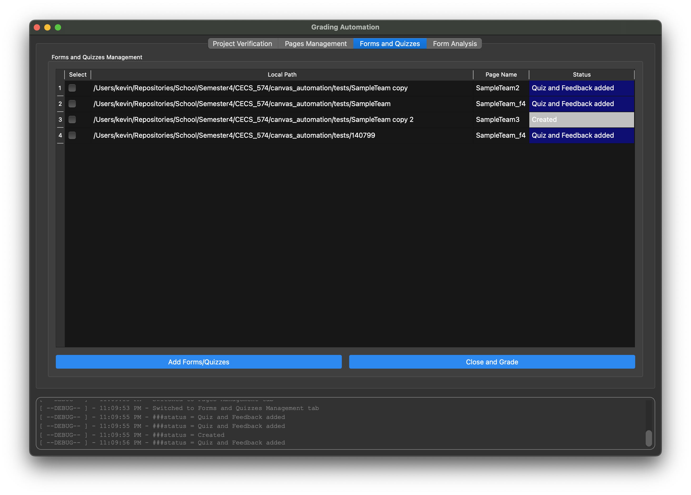

# Canvas Automation 
For the most recent [Project Documentation](https://kevindlopez.github.io/canvas_automation). 

## Running Python Script
Before running the script, please complete the **Python environment setup** to ensure all necessary libraries are installed.
## Prerequisites
1. Ensure the Canvas access token is configured (see [Setting up Canvas access token](#setting-up-canvas-access-token)).
2. Have an google email with permissions and a  `client_secrets.json` to allow testing.

## Steps:
1. Run application using one of the following methods:
   -  Navigate to the project directory and Run `python GradingAutomationUI.py`
      -  **Complete the [Setting up Python](#setting-up-python) section** for required installations.
      - Place the `client_secrets.json` file in repository.
   -  Download application from the latest release. # IS IT POSSIBLE TO ADD A URL or LINK here?
      -  Run the executable file not the .app file. Is easier for deluging and it runs faster
      -  If running in macOS, you will need to [allow opening the app from an unknown developer](https://support.apple.com/guide/mac-help/open-a-mac-app-from-an-unknown-developer-mh40616/mac)
      - Place the `client_secrets.json` file in the same location of executable.

2. Enter the canvas class id, your canvas access token, and the presentation module title.

   For this demo, the class id is `15319` and the presentation module title is `Fall 2024 - Presentation`
   
    
    
    
3. Download student submissions:
 - Simpliy downwnload the student submissions by clicking on the download button of the project verification tab. 
 - A pop up will show to ask which title is the assignment is given. In the sample class we were testing was `Presentation` so that is what we tested with. 
    <div style="display: flex; justify-content: space-between;">
    
    
    </div>

4. Locate the path for this git repository/tests/ ( or any location where students projects are located) and Click on "Verify Selected Projects".

   A sample output would look like this:

   

5. Navigate to "Page Management" and Select rows to create pages from the group folders in the repository.

   A sample output of creating pages for three test projects would look like this:

   


5. In the "Forms and Quizzes Tab", you can select created pages to add feedback forms and quizzes.

   Sample output for adding feedback form and quiz for the "SampleTeam_f4" page:

   

6. Clicking on the "Close and Grade" button would remove the feedback form on the team page, update the page with a grade distribution from the feedback forms, and post the grade for the team members.

    Sample page output on Canvas after retrieving grade distribution from feedback forms:

   

---
## Setting up python

### Using Conda Environment
1. Create Env.
    ```bash
    conda env create -f pyqt-env.yml
    ```
2. Activate
    ```sh
    conda activate pyqt-env
    ```
3. Update packages
    ```bash
    conda env update -f pyqt-env.yml --prune
    ```

### Using Python Requirements File
1. Create a virtual environment:
    ```sh
    python -m venv venv
    ```
2. Activate the virtual environment:
      - On Windows:
        ```bash
        venv\Scripts\activate
        ```
      - On macOS and Linux:
        ```bash
        source venv/bin/activate
        ```
1. Install packages from requirements.txt:
    ```bash
    pip install -r requirements.txt
    ```
2. To update packages, modify the requirements.txt file and run:
    ```bash
    pip install --upgrade -r requirements.txt
    ```

---
## Setting up Canvas access token
1. Login into Canvas and Navigate to Account Settings


2. Scroll down until you find the <u>Approved Integrations subsection</u> and Create an access token by clicking New Access Token button


3. Specify the purpose and expiration date, create the new access token, save it on your computer.


---
## Running google script
0. Setup google project with API support, allow users to test ap!
1. Download credentials
2. The credentials are not pushed to git, it should be a `./client_secrets.json`
3. Run the python script `python ./GoogleServices/GoogleServices.py/` or use the `./google_forms.ipynb`


##  Data visualization of grades
1. Set up python based on above instructions - [Setting up Python](#setting-up-python)
2. Place `S24-574-all-responses.xlsx` in this same directory
3. Open `./removing_outliers.ipynb`
4. Select the python environment `pyqt-env`  or `venv`
5. Click on run all
